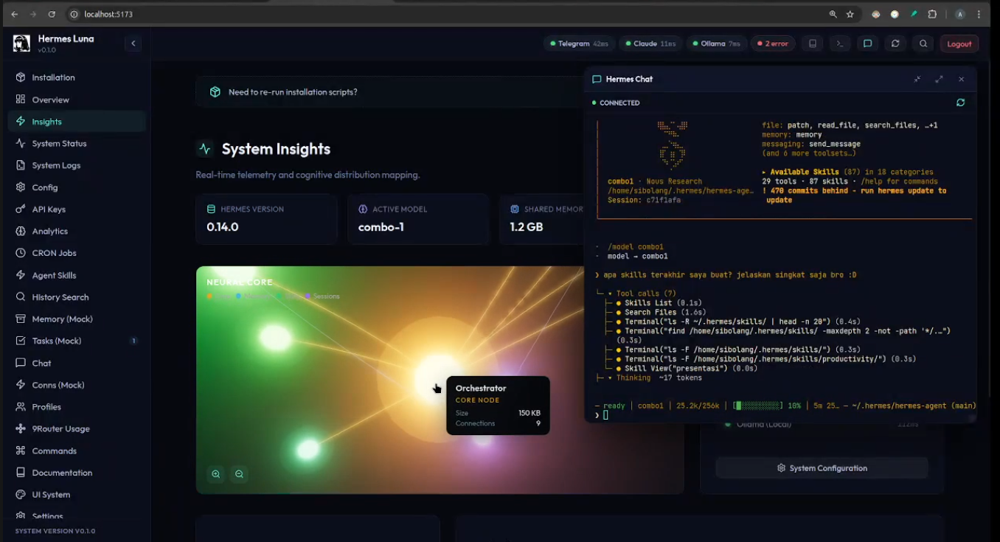

# 🌙 Hermes Luna Dashboard

<p align="center">
  
</p>

Luna Dashboard adalah antarmuka utama berbasis antarmuka grafis (GUI) untuk sistem **Hermes**. Dashboard ini dibangun menggunakan arsitektur _split-stack_:

> ⚠️ **DISCLAIMER:** Ini bersifat **experimental**. Lihat dulu kode sebelum install. Kami tidak bertanggung jawab atas apapun yang terjadi pada sistem anda walau harusnya aman-aman saja 😄

- **Frontend** menggunakan React + Vite (untuk UI visual, peta graph 3D kognitif, dsb).
- **Backend** menggunakan Python (FastAPI + Uvicorn) yang bertindak sebagai _bridging_ data antara web dan agen AI (Agentic Core/9Router).

---

## 📍 Lokasi Instalasi

**PENTING:** Luna harus diletakkan di dalam folder `.hermes`:

```
~/.hermes/luna/
```

Luna dirancang untuk:
- ✅ **Berjalan standalone** - Luna dapat berfungsi penuh bahkan tanpa Hermes atau 9Router terinstall
- ✅ **Auto-detect Hermes** - Jika Hermes sudah terinstall, Luna akan otomatis mendeteksi dan terintegrasi
- ✅ **Auto-detect 9Router** - Jika 9Router tersedia, Luna akan otomatis terhubung ke API routing

---

## 🛠 Instalasi Awal (Setup)

### Langkah 1: Pastikan Luna di Lokasi yang Benar

```bash
# Pastikan Luna berada di folder .hermes
cd ~/.hermes/luna
```

### Langkah 2: Install Python (Backend)

Luna membutuhkan **Python 3.10+** untuk backend.

**Cek dulu:**
```bash
python3 --version
```

**Kalau belum ada:**

- **Ubuntu/Debian:**
  ```bash
  sudo apt update && sudo apt install python3 python3-pip python3-venv -y
  ```
- **macOS (Homebrew):**
  ```bash
  brew install python@3
  ```
- **Windows:** Download installer dari https://python.org — pastikan centang ✅ "Add Python to PATH"

### Langkah 3: Install Dependensi Python (Backend) — WAJIB

Backend menggunakan FastAPI + Uvicorn. **Disarankan pakai virtual environment:**

```bash
# Buat virtual environment (sekali saja)
python3 -m venv venv

# Aktifkan
source venv/bin/activate   # Linux/macOS
# venv\Scripts\activate    # Windows

# Install library
pip install -r backend/requirements.txt
```

**Isi `backend/requirements.txt`:**

| Package | Fungsi |
|---------|--------|
| `fastapi` | Web framework backend |
| `uvicorn[standard]` | HTTP server buat FastAPI |
| `pyyaml` | Baca file konfigurasi YAML |
| `ptyprocess` | Spawn proses terminal |

> 💡 **Catatan:** Kalau gamau pake venv, bisa langsung `pip install -r backend/requirements.txt` — tapi venv lebih rapi biar nggak campur sama Python system.

### Langkah 4: Install Dependensi Node.js & Frontend

```bash
npm install
```

### Langkah 5: Konfigurasi Environment (Opsional)

Salin dan edit file `.env` sesuai kebutuhan:

```bash
cp .env.example .env  # Jika ada template
# Atau edit langsung .env yang sudah ada
```

Pastikan kredensial di `.env` sudah diisi dengan benar.

---

## 🔍 Deteksi Otomatis Hermes & 9Router

Luna dirancang dengan sistem deteksi otomatis yang cerdas:

### Deteksi Hermes
Luna akan mencari instalasi Hermes di:
- `~/.hermes/` (lokasi standar)
- Jika ditemukan, Luna akan mengakses konfigurasi, memory, dan fitur Hermes
- Jika tidak ditemukan, Luna tetap berjalan dengan fitur standalone

### Deteksi 9Router
Luna akan mencoba terhubung ke 9Router API di:
- Default: `http://localhost:20128` (sesuai `.env`)
- Jika 9Router aktif, fitur routing dan agentic core akan tersedia
- Jika tidak aktif, fitur routing akan di-disable secara otomatis

**Status koneksi** akan ditampilkan di dashboard UI saat Luna berjalan.

---

## 🚀 1. Mode Development (`./serve`)

Mode ini khusus digunakan jika Anda sedang **mengembangkan (coding)** dan ingin perubahannya langsung terlihat.

**Cara Menjalankan:**

```bash
./serve
```

_(Atau `npm run dev` secara manual)_

**Apa Hasilnya & Cara Kerjanya?**

- Mengeksekusi server web **Vite** (frontend) pada port bawaan (misal `5173`).
- Mengeksekusi **Uvicorn** (backend) dengan flag `--reload` di port `8119`.
- Segala perubahan kode yang Anda ketik (baik file Python maupun `.jsx`) akan **otomatis me-refresh UI** tanpa harus merestart terminal (_Hot Module Replacement_ / HMR).
- _Proses ini mengikat shell console terminal Anda_. Apabila terminal Anda diputus atau Anda menekan `Ctrl+C`, seluruh aplikasinya ikut terhenti.

---

## 🌍 2. Mode Production & Daemon (`./start.sh`)

Mode ini digunakan untuk **penggunaan jangka panjang (Production / Background)**. Mode ini sangat disarankan untuk Anda pasang di perangkat _server_ atau VPS agar terus berjalan stabil.

**Cara Build:**
Sebelum menjalankan ke mode production ini, frontend React harus di-_compile_ menjadi file statis terlebih dahulu agar super-ringan & cepat.

```bash
npm run build
```

_(Proses ini akan menghasilkan folder `dist/` yang berisikan aset final siap pakai html/js/css optimal)._

**Cara Menjalankan Biasa:**

```bash
./start.sh
```

**Cara Menjalankan sebagai Web Daemon (Background Forever):**
Gunakan _process manager_ bawaan Node seperti `pm2`.

```bash
pm2 start ./start.sh --name "luna-dashboard"
```

**Apa Hasilnya & Cara Kerjanya?**

- Menjalankan **backend** Uvicorn _tanpa fitur auto-reload_ (membuat RAM lebih lega, respons sangat cepat).
- Backend akan otomatis terbuka melayani request-API (port `8119`).
- Mengeksekusi web server lokal ultra-ringan (`npx serve dist`) di **port `3000`** yang bertugas menyajikan folder `dist/` ke peramban tanpa memberatkan node memory sama sekali.
- Jika digunakan bersama `pm2`, log dari error sistem atau restart sistem akan dikelola mandiri secara diam-diam (_daemon_) di latar terminal mesin. Dashboard akan terus hidup walau Anda log-out dari sistem PC.

---

## ⌨️ Daftar Global Shortcuts

Untuk memudahkan mobilitas kognitif AI dalam kontrol panel, sediakan beberapa fitur melayang (Floating View) yang bebas dipanggil dari bagian halaman mana pun:

- `Ctrl + K` : Membuka jendela komando pencarian (Search Commands)
- `Ctrl + J` : Membuka jendela perintah eksekusi cepat (Quick Commands)
- `Ctrl + H` : Menampilkan panel Dokumentasi Mengambang (Floating Global Documentation)
- `Ctrl + X` : Menampilkan panel Interaksi Obrolan Agen (Global Chat)
